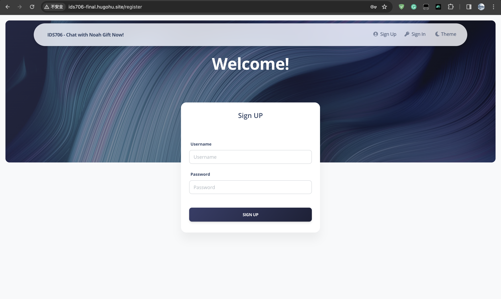
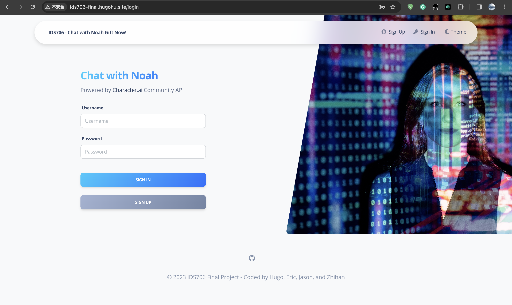
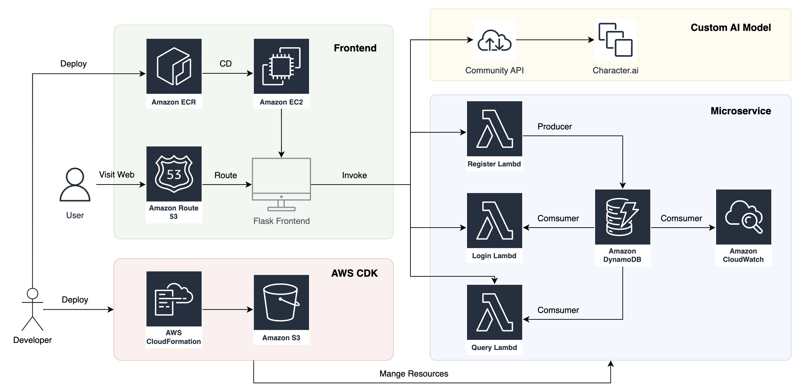
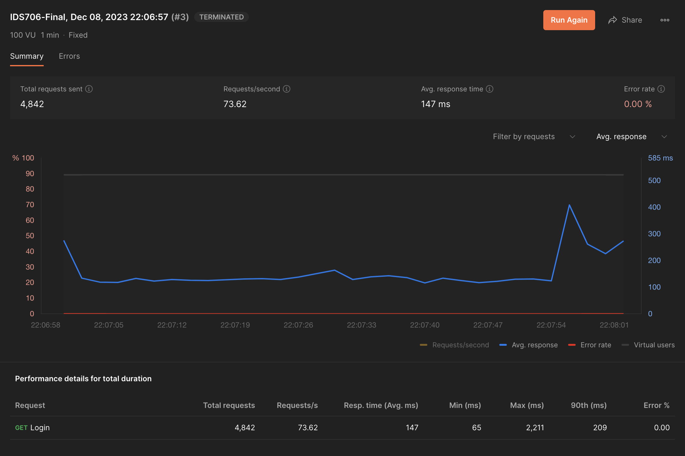
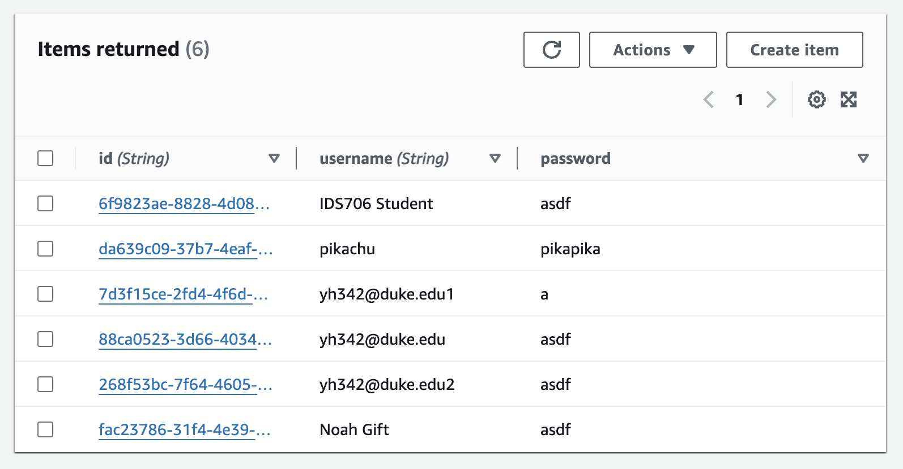
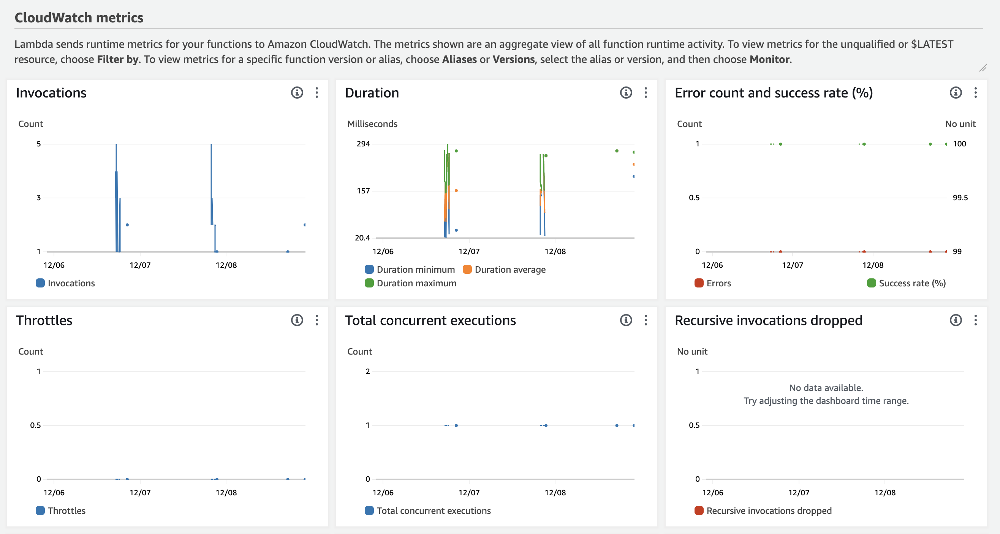

[](https://github.com/nogibjj/IDS706-Fall2023-FinalProject/actions/workflows/binary.yml)
[](https://github.com/nogibjj/IDS706-Fall2023-FinalProject/actions/workflows/lint.yml)
[](https://github.com/nogibjj/IDS706-Fall2023-FinalProject/actions/workflows/rustfmt.yml)

[Youtube Video Here](https://youtu.be/_DSV9nnL_Gc) 
&nbsp;&nbsp;


## Final Project: Chat with Noah Gift!

### 0. Description
This project contains two sub-projects: ```frontend``` and ```microservice```.
- ```frontend``` is a Flask-based web application that allows users to create an account, log in, and chat with Noah Gift (a customized AI model)
- ```microservice``` is a AWS-DynamoDB-Lambda-based microservice that supports the authentication functionalities

The microservice is fully managed by **AWS CDK** to achieve **Infrastructure as Code**. And the application is containerized, and deployed on **AWS ECR** and run on **AWS EC2**.

You can try it on: [http://ids706-final.hugohu.site](http://ids706-final.hugohu.site)

### 1. Demo
You can create an account with any ```username``` and ```password```, unless the ```username``` is already taken (**IDS706 User**, **Noah Gift**, for example are already taken). Then you can log in to start a chat.

**Note that**, due to the access limitation of the AI model (I used my personal access token here for every account), your message might be delayed for a few seconds. And in some rare conditions, you may even find a conversation history that not belongs to you and the current "Noah Gift". This bugs is due to the community version of the API. And I cannot fix that on my end.






### 2. Architecture Diagram



### 3. How to run
#### 3.1. Microservice
Build the docker image:
```bash
cd microservice
docker build -t microservice .
```

**Before the following steps, first make sure your AWS credentials has enough permissions to create the resources.**

Export the environment variables:
```bash
export AWS_ACCESS_KEY_ID=<your aws access key id>
export AWS_SECRET_ACCESS_KEY=<your aws secret access key>
# The region is very important as all the resources will be created in this region
export AWS_DEFAULT_REGION=<your aws region>
```

Run the docker image with the environment variables:
```bash
docker run -e AWS_ACCESS_KEY_ID=$AWS_ACCESS_KEY_ID -e AWS_SECRET_ACCESS_KEY=$AWS_SECRET_ACCESS_KEY -e AWS_DEFAULT_REGION=$AWS_DEFAULT_REGION microservice
```

Other commands you may need to manage your AWS resources:
```bash
# Bootstrap your AWS CDK project
cdk bootstrap
# Synthesize the CloudFormation template
cdk synth
# Deploy the CloudFormation template
cdk deploy
# Destroy the CloudFormation template
cdk destroy
```

#### 3.2. Frontend
Build the docker image:
```bash
cd frontend
docker build -t frontend .
```

Go to Character AI website to get your own access token: [https://character.ai/](https://character.ai/) from your web browser's local storage.

**Before going to the next step, make sure you have created a customized AI model on the Character AI website. Instructions on how to create a customized AI model can be found here: [https://book.character.ai/character-book/welcome-to-character-book](https://book.character.ai/character-book/welcome-to-character-book)**

Expose the environment variables:
```bash
export CHARACTER_AI_TOKEN=<your character ai token>
```

Substitute the ```user_id```, ```char_id``` in ```apps/home/routes.py``` with your account info.

Run the docker image:
```bash
# You have to expose the port 80 for public access
# Use nohup to run the docker image in the background
sudo nohup sudo docker run -p 80:80 -e CHARACTER_AI_TOKEN=$CHARACTER_AI_TOKEN -e AWS_ACCESS_KEY_ID=$AWS_ACCESS_KEY_ID -e AWS_SECRET_ACCESS_KEY=$AWS_SECRET_ACCESS_KEY -e AWS_DEFAULT_REGION=$AWS_DEFAULT_REGION frontend &
```

#### 3.3. Bind Domain Name
You can use the public DNS name of the EC2 instance to access the application.

First you need to do is to assign an Elastic IP to the EC2 instance. Then you can go to the AWS Route 53 service to create a hosted zone for your domain name. Finally, create A record and CNAME record in your DNS provider to bind the Elastic IP to your domain name.


### 4. Load Test
I've investigated that to use the **DDoS attack** on AWS can be very complicated and expensive. So I simply do the load test using the **Postman**.

However, for the free version, I can only send 100 requests/second, far below the 10,000 requests/second requirement.

To save my expense on invoking the Lambda function, I just keep the 100 requests/second. As for this toy project, I think this is enough.



The result shows that my application can easily handle 100 requests/second with ```0 error rates```. And the average response time is ```147ms```, which is acceptable.

### 5. Data Engineering
This application interacts with **AWS dynamoDB** to store the user information.

For the local Flask authentication, a ```SQLite``` database is used.

The data model is very simple. It only contains two columns: ```username``` and ```password```.

The preview of this table (there's no risks of exposing the password as it's free to create):



### 6. Infrastructure as Code (IaC)
The project is fully managed by **AWS CDK** to achieve **Infrastructure as Code**.

Some sample code with comments:

```python
class DynamodbLambdaStack(Stack):
    def __init__(self, scope: Construct, id: str, **kwargs) -> None:
        super().__init__(scope, id, **kwargs)

        # create dynamo table
        demo_table = aws_dynamodb.Table(
            self,
            "user_info",
            partition_key=aws_dynamodb.Attribute(
                name="id", type=aws_dynamodb.AttributeType.STRING
            ),
            sort_key=aws_dynamodb.Attribute(
                name="username", type=aws_dynamodb.AttributeType.STRING
            ),
        )

        # create producer lambda function
        producer_lambda = aws_lambda.Function(
            self,
            "write_to_dynamodb_lambda_function",
            runtime=aws_lambda.Runtime.PYTHON_3_11,
            handler="write_to_dynamodb_lambda.lambda_handler",
            code=aws_lambda.Code.from_asset("./lambda/producer"),
        )

        producer_lambda.add_environment("TABLE_NAME", demo_table.table_name)

        # grant permission to lambda to write to demo table
        demo_table.grant_write_data(producer_lambda)
        ...
```

### 7. Quantitative Assessment
Since I deployed the application on the **Free-tier** AWS EC2, the CPU is not as powerful as I expect. So, if multiple users are chatting with the AI model at the same time, the response time will be a little bit longer.

Below I print the ```Login Lambda```'s response time to analyze the performance of the application.



The maximum response time is ```300ms``` which is acceptable for the log in function.

### 8. Teamwork Reflection
See ```teamwork``` direction for our four team members' reflection and contribution.

### 9. Dependencies
#### 9.1. Flask Skeleton
The Flask frontend uses template from [flask-soft-ui-dashboard](https://github.com/app-generator/flask-soft-ui-dashboard).

#### 9.2. AWS CDK
The AWS CDK is referenced from the official example in [aws-cdk-samples](https://github.com/aws-samples/aws-cdk-examples).

#### 9.3. Customized AI Model
The customized AI model is created on [Character AI](https://character.ai/).

While the official website does not expose its API, so I use the community API from [CharacterAI](https://github.com/kramcat/CharacterAI).

### 10. License
Apache License